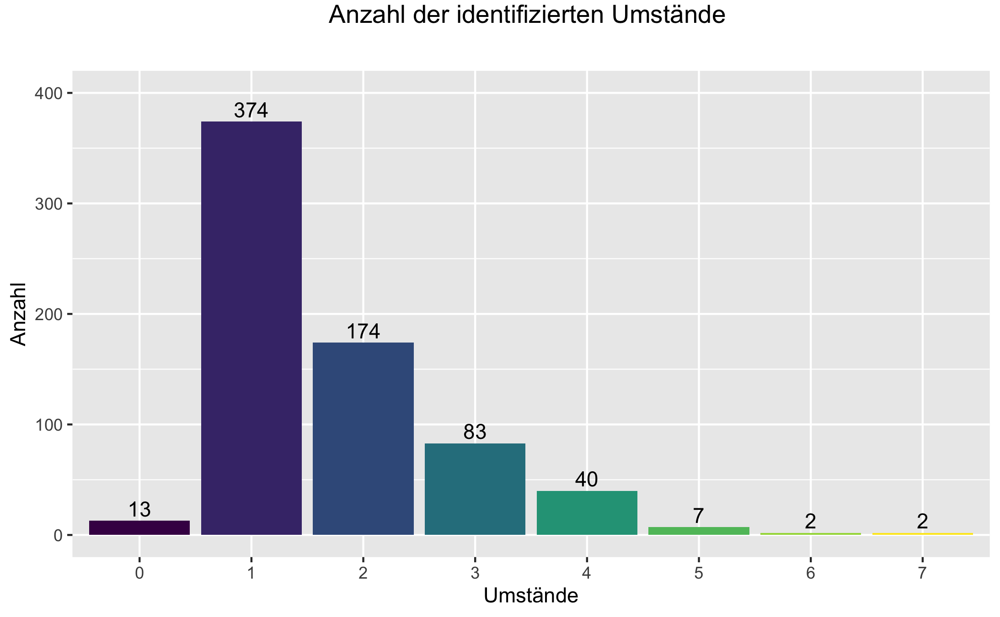
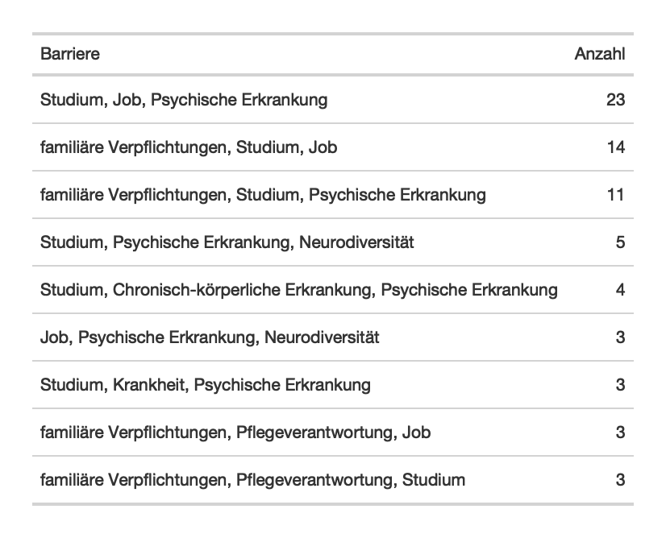
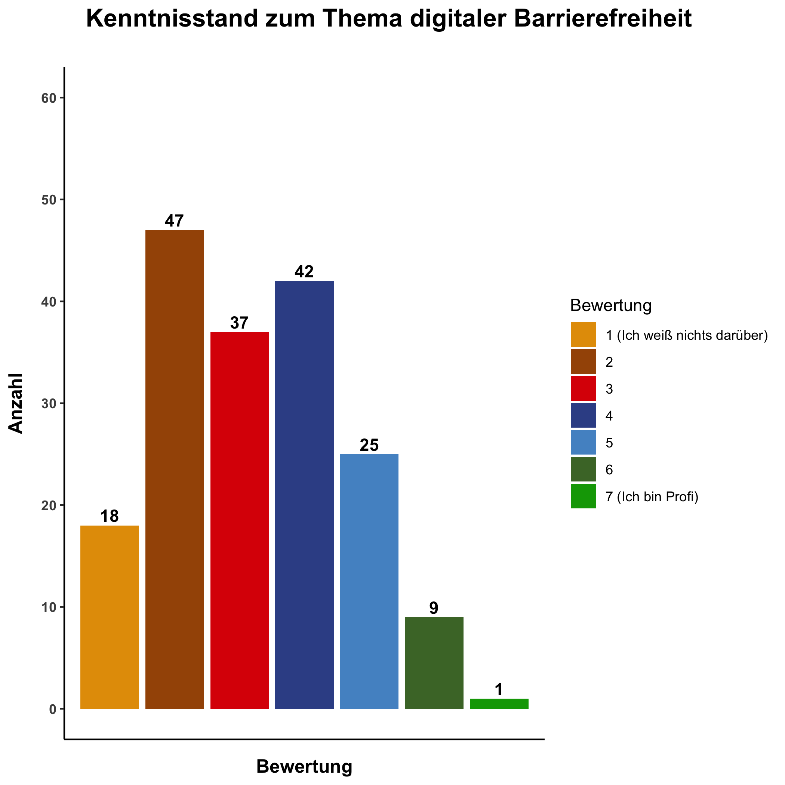
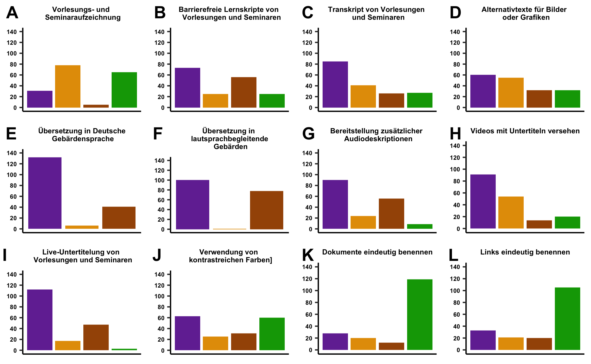
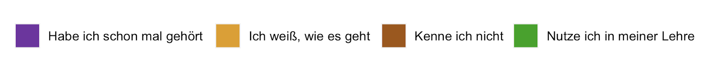

## Accessibility Survey

### Project Overview
This project outlines data analysis for two surveys that were run to investigate the barriers, pain points, and strategies used by students with individual needs (SmiBs) in the University/Hochschule system in Germany, and the knowledge and skills that Lecturers have to deal with this. This information provided information on the level of digital accessibility in educational materials was used in the design and development of opensource products to support these students indirectly by assisting the teachers: (i) the [BlindDate website](https://shuffle-project.github.io/blinddate/) which provides a virtual encounter with SmiBS through interactive personas, and serious games; and (ii) [MELVIN](https://melvin.shuffle-projekt.de/de-DE/auth) a live, multiuser video caption editor and accessible player.

### Data Sources
The data is taken from LimeSurvey exported .csv files. The student survey (SS) consisted of answers from 695 respondents and 23 open-ended, Yes-No, or scaled items, with a combination of quantitative and qualitative data. The teacher surevy (TS) had 169 respondents with a similar range of questions. Key questions focused on: 
* __Type of Disability (SS)__  includes disability categories (e.g. Visual disability, Autism; AD(H)D) as well as family care barriers.
* __Barriers (SS)__ examines how well the students can access a range of teaching and learning materials including videos, PowerPoints, readings, live lectures etc.
* __Exams and Accommodations (SS)__ focuses on how students deal with their barriers in Exam conditions, and in assignments and what types of support and accommodations are provided.
* __Study Level (SS)__ information included type of study( Bachelor, Masters) and which Semester, as students would have different levels of experience dealing with challenges depending on their previous time spent studying.
* __Teacher Knwoledge/Skills (TS)__ focuses on what knowledge teachers have about types of barrier needs and how tomake their materials accessible.
* __Teacher Training (TS)__ examines what type of training they have had and are willing to do.

### Tools

### Data Cleaning/Preparation
Most initial data prepration was done by the LimeSurvey platform which identified incomplete answers and any missing values. The data were still checked for NULL values, but no records were removed from the analysis. Lime survey also provdies initial descriptive statistics showing the percentage of each answer from the total. 

### Data Analysis
While the data did not initial summarization into percentages of total answers, this was not felt to be sufficient. Analysis focused on two areas:
* Improving the quality of data visualizations for simple descriptive statistics
* Delving into more complex relations in the data
* Deriving sentiment from the open-ended questions through an automated pipeline that could be traingulated with thematic analysis.
These data were analysed with R and some text material with Python. Visualizations were done using R

#### Insights
* Many students have more than one barrier type that compounded the impact of their barriers. This increases the need to make materials accessible in general rather than targeting a specific barrier type.

  

   
* Students had a less than positive assesment of the level of knowledge that teaching staff had about their needs and their willingness to help.
* Teaching staff did not think that they had much knoweldge about digital accessibility.
  
  
* Teaching staff on average did not seem to think that they had students with disabilitie in their classes and/or were complacent about their needs.
* Teachers had more knowledge in certain areas than others.

      

### Further Data Analysis

